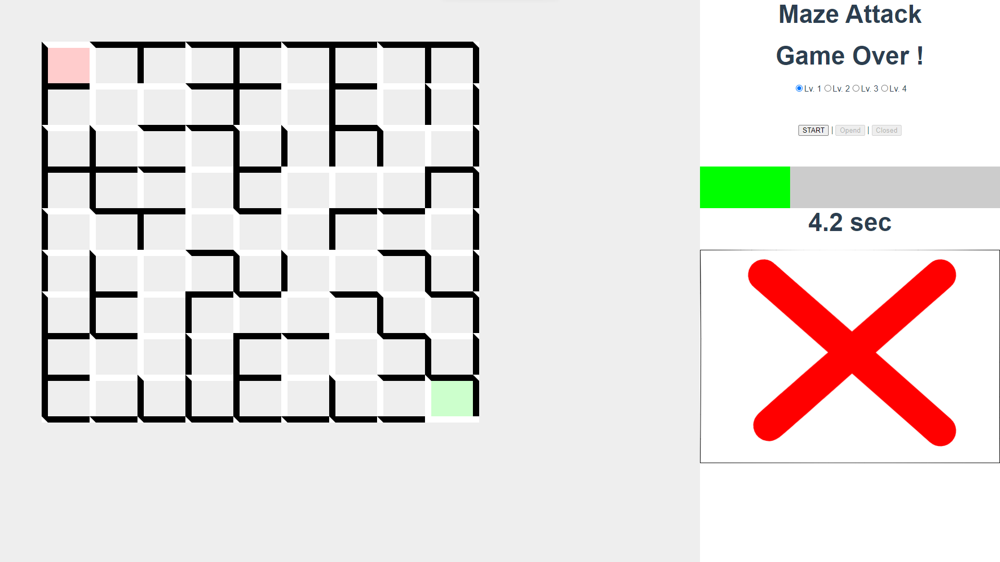

# p99
## ゲーム概要
 * 画面に表示された迷図が解けるかどうかを当てるゲーム。
 * 10問を何秒で解けるかを競う。
 * レベルは、1～4まである。

## 画面イメージ


# 開発環境
## Project setup
```
npm install
```

### Compiles and hot-reloads for development
```
npm run serve
```

### Compiles and minifies for production
```
npm run build
```

### Lints and fixes files
```
npm run lint
```

### Customize configuration
See [Configuration Reference](https://cli.vuejs.org/config/).
